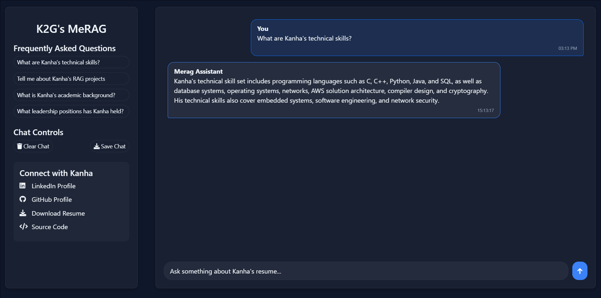

# 🤖 Resume Chatbot – End-to-End AI Assistant Using Flask, LangChain, and OpenRouter




This project is an **end-to-end intelligent chatbot** designed to answer questions based on the contents of a **PDF resume**. It utilizes:

- 🧠 **LangChain** for document loading, text splitting, and embedding  
- 🤗 **HuggingFace Inference API** for embedding generation  
- 🧬 **Chroma** as a vector store for semantic search  
- 🤖 **OpenRouter LLMs** for answering context-based queries  
- 🌐 **Flask** as the backend framework for API and UI  
- 📄 **HTML (Jinja2)** for the frontend

---
## 🎥 Demo

Watch the working demo of the Resume Chatbot:

🔗 [Click here to view demo video on Google Drive](https://drive.google.com/file/d/1GVM8teHJM4MyzSRx6tYjoxtvIYqCim_m/view?usp=drive_link)

---
## 📌 Features

- 🔍 Extracts precise answers from your resume (PDF format)  
- 💬 Chat interface with timestamped history  
- 🔄 Reset chat history at any time  
- 📁 Export entire chat as a downloadable JSON file  
- ✅ Restricts AI answers strictly to the context provided

---

## 📁 Folder Structure

```
resume-chatbot/
├── app.py                # Flask application
├── test.pdf              # The resume PDF
├── templates/
│   └── index.html        # UI template
├── .env                  # Environment variables
├── requirements.txt      # Dependencies
└── README.md             # Documentation
```

---

## ⚙️ Installation & Setup (End-to-End)

### 1. Clone the Repository

```bash
git clone https://github.com/yourusername/resume-chatbot.git
cd resume-chatbot
```


### 2. Add Your Resume PDF

Place your resume in the root directory as:

```bash
test.pdf
```

### 3. Set Up Environment Variables

Create a `.env` file:

```
HF_TOKEN=your_huggingface_token
OR_TOKEN=your_openrouter_token
```

### 4. Install Requirements

`requirements.txt` should include:

```
python-dotenv
langchain
langchain-community
openai
gunicorn
```

Install with:

```bash
pip install -r requirements.txt
```

---

## ▶️ Running the App

### Development Mode

```bash
python app.py
```

Visit: [http://localhost:5000](http://localhost:5000)

### Production with Gunicorn

```bash
gunicorn app:app
```

---

## 💡 Sample Questions

- "What are Kanha's technical skills?"  
- "Tell me about Kanha's RAG projects"  
- "What is Kanha's academic background?"  
- "What leadership positions has Kanha held?"

---

## 📤 Utilities

| Endpoint         | Method | Function                                |
|------------------|--------|------------------------------------------|
| `/`              | GET    | Home interface                           |
| `/ask`           | POST   | Ask question                             |
| `/history`       | GET    | View chat history                        |
| `/clear_history` | POST   | Clear the current chat                   |
| `/download_chat` | GET    | Export chat as a JSON file               |

---

## 🔍 How It Works

1. Loads PDF using LangChain's PyPDFLoader  
2. Splits text using RecursiveCharacterTextSplitter  
3. Embeds text via HuggingFace API  
4. Stores chunks in Chroma vector DB  
5. Retrieves top 3 relevant chunks per query  
6. Forms prompt for OpenRouter LLM  
7. Responds with context-only output

---

## 👨‍💻 Author

**Kanha Khantaal**

---

## 📜 License

Licensed under the **MIT License**.

---

## 🙏 Acknowledgements

- [LangChain](https://github.com/langchain-ai/langchain)  
- [HuggingFace](https://huggingface.co/)  
- [OpenRouter](https://openrouter.ai/)  
- [Chroma](https://www.trychroma.com/)  
- [Flask](https://flask.palletsprojects.com/)
